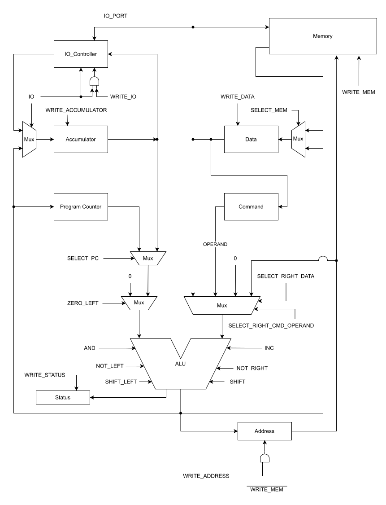
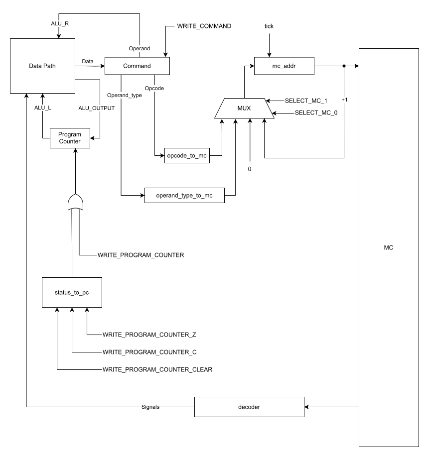

# Variant

- Тернавский Константин Евгеньевич. P3206

```
asm | acc | neum | mc -> hw | tick -> instr | struct | stream | port | pstr | prob2 | cache
```

- Базовый вариант

## Transcript

- assembler
- accumulator
- Von Neumann (same memory for commands and data)
- Microcode
- accurate up to tick
- code is stored as High-Level structure
- Stream IO (no interrupts)
- IO devices addressed by ports. Separate IO instruction
- Pascal strings (length + content)
- Prob 2. Even Fibonacci numbers
- Cache (***not implemented***)

# Table of content

- [Variant](#variant)
  - [Transcript](#transcript)
- [Table of content](#table-of-content)
- [Language](#language)
  - [Syntax](#syntax)
  - [Semantics](#semantics)
  - [Literals](#literals)
  - [Argument types](#argument-types)
  - [Assembler directives](#assembler-directives)
- [ISA](#isa)
  - [Instruction format](#instruction-format)
  - [Instruction pipeline](#instruction-pipeline)
  - [Operand types](#operand-types)
- [Memory](#memory)
- [CPU Architecture](#cpu-architecture)
  - [Data path](#data-path)
    - [Registers](#registers)
    - [ALU](#alu)
  - [Control unit](#control-unit)


# Language

## Syntax

> `number` is 16-bit number
> `number(n)` is n-bits number

Assembly:
```ebnf
program ::= lines

lines ::= line | line lines

line ::= new_line | statement new_line

statement ::= item | label item

label ::= word ":"

item ::= empty | command | directive

// command names are matched case-insensitive
command ::= command_none
          | command_address
          | command_immediate
          | command_port

command_none ::= "inc" 
               | "shift_left"
               | "shift_right"
               | "nop"
               | "halt"

command_address ::= opcode_address address

opcode_address ::= "load"
                 | "store"
                 | "add"
                 | "and"
                 | "cmp"
                 | "jzc"
                 | "jzs"
                 | "jz" // alias for jzs
                 | "jcc"
                 | "jcs"
                 | "jc" // alias for jcs
                 | "jump"

address ::= address_relative 
          | address_absolute
          | address_indirect


address_relative ::= actual_address

address_absolute ::= "!" actual_address

address_indirect ::= "(" actual_address  ")"

actual_address ::= word | number

command_immediate ::= "andi" number

command_port ::= opcode_port port

opcode_port ::= "in" | "out"

port ::= number(8)

// supports numbers:
// decimal: 145, 0001
// hex: 0xaf
// bin: 0b010101
number ::= "^(?P<prefix>0[xb])?(?P<number>[\dabcdef_]+)"

directive ::= directive_word | directive_org

directive_word ::= "word" word_arguments

word_arguments ::= word_argument | word_argument word_arguments

word_argument ::= number(32) | label

directive_org ::= "org" number

```

> Note: space symbols are not considered and are skipped
> Space symbols are defined as following set: " "

## Semantics

- strategy of computation: *sequential*
- label's scope: *global*

## Literals

For number endian see [Memory](#memory) section.

> We use notion of number types similar to rust's one:  
> first letter says the type and affects sign extension:
> - `u` no sign extension happens. Value treated as **U**nsigned
>
> The letter is followed by a number. The number signifies amount of bits
> available to represent a number.
>
> Examples:
> - `u32` - 32-bit unsigned number
> - `u16` - 16-bit unsigned number

All literals are numbers with different range of values. All numbers have the same syntax. Range is determined based on usage context: command's argument type defines literal meaning. For details see command's argument types table.

Number literals support following prefixes:
- `0x` - for *hex* numbers
- `0b` - for *binary* numbers

Example:
```
decimal: 145, 0001
hex: 0xaf
bin: 0b010101
```


<hr>

Numbers without prefix are treated as *decimals*.

Numbers *may* contain any amount of `_` at any point after prefix (or anywhere if there is no prefix):

Example:

- `4000`
- `4_000`
- `4_____000`
- `___4_000___`
- `0x____fa0`

are all mean `4000` decimal value.


## Argument types

- `none` - command requires no arguments. Placing anything would result into error.
- `port` - command requires single number which denotes IO device's address. Number is treated as `u8`
- `immediate` - command requires single number. Number is treated as `u16`
- `label` - special argument type. It requires single word. Word is a sequence of unicode letters. It may contain any number of `_` in any position. Used within composite type `address` and with [`word` directive](#assembler-directives).
- `address` - composite type. see notes and table below
- There are other types. They are special and used in conjunction with [Assembly directives](#assembler-directives)

`Address` type is either number treated as `u16` or label. Address allows modifiers to switch addressing mode. 

In the following table, strings enclosed with `""` means literal characters present in source code. `|` means *alternative*. `()` are used to *group items*.

That is `"!" (u16 | label)` means exclamation mark followed by either number literal or label where number literal is interpreted as 16-bit unsigned number

Each addressing in this table corresponds to appropriate [addressing mode of CPU](#addressing-modes-argument-types).

<table>
  <thead>
    <tr>
      <td>Mode</td>
      <td>Syntax</td>
      <td>Example</td>
    </tr>
  </thead>
  <tbody>
    <tr>
      <td>Relative</td>
      <td><code>u16 | label</code></td>
      <td><pre>load 0x55<br>load 145<br>load some_label</pre></td>
    </tr>
    <tr>
      <td>Absolute</td>
      <td><code>"!" (u16 | label)</code></td>
      <td><pre>store !0x55<br>store !some_label</pre></td>
    </tr>
    <tr>
      <td>Indirect</td>
      <td><code>"(" u16 | label ")"</code></td>
      <td><pre>load (some_label_ptr)<br>load (0x55)</pre></td>
    </tr>
  </tbody>
</table>

## Assembler directives

- `data` - special argument type used with assembler directive `word`. It requires *one or **more** numbers* each seperated with at least one space. Each number is treated as `u32`. That is, although, value `0xff` perfectly fits into one byte, `word 0xff` occupies whole [memory cell](). *Notice, that no sign extension takes place! Value is placed as is*: 
  `0x00_00_00_ff`

Assembler directives are not represented in CPU's memory. They are special commands intended to assist you write assembly code. 

<table>
  <thead>
    <tr>
      <td>Directive</td>
      <td style="width: 25%;">Allowed argument types</td>
      <td>Comment</td>
    </tr>
  </thead>
  <tbody>
    <tr>
      <td><code>word</code></td>
      <td><code>data | label</code></td>
      <td>places numbers into memory as is. can be used with labels to make pointers. I.e. <code>word some_label</code> places an address and <i>NOT the content at the address</i> which <code>some_labels</code> refers to.</td>
    </tr>
    <tr>
      <td><code>org</code></td>
      <td><code>u16</code></td>
      <td>instructs assembler where to place next code item 
       (be it a raw value or a command) into cell with address ADDRESS.
       Subsequent code items will be placed after ADDRESS one by one</td>
    </tr>
  </tbody>
</table>


Example:

```asm
org 0x04f
VAR1: word 0x45a9 0xff
add 0xf
cmp VAR1
```
Here `0x0000_45a9` will be placed in memory as is at address `0x04f`; `0x0000_00ff` at `0x0050`. `add 0xf` at `0x0051` and so on

# ISA

This section describes opcodes and operand type suggested for use with them. 

Notice, that every command may theoretically work with every operand type except `none` operand type, though that has not been tested and may lead to undefined behaviour.

Providing `none` operand type for command which requires any other type results in CPU panicking.

Commands which suggest `none` operand type will simply ignore any operand, although operand fetch would still be executed. So that you *can* but you *should not* specify any operand type except `none` for commands which except `none`.

For this table let's introduce notion of special operand type `operand`. It *requires* operand type to be any of `Relative|Indirect|Immediate|Absolute`. Notice that `none` is ***forbidden*** for this speical type.

```
IN          immediate    - read data from IO device
OUT         immediate    - write data to IO device

LOAD        operand - load value into accumulator
STORE       operand - store value from accumulator into memory cell

ADD         operand - well... add a number?
INC         none    - add 1 to accumulator

// (to check for even values by applying 0x1 mask)
AND         operand
CMP         operand - subtract number from accumulator without 
                      storing result anywhere. Sets status flags.
                      Useful for branching
SHIFT_LEFT  none
SHIFT_RIGHT none

JZC         operand - Jump if Zero Clear
JZS         operand - Jump if Zero Set
JCC         operand - Jump if Carry Clear
JCS         operand - Jump if Carry Set
JUMP        operand - Unconditional jump

NOP         none    - does nothing
HALT        none    - Stops the simulation
```

Assembler supports variants of some instructions with immediate argument. Namely:
```
AND -> ANDI // useful for masking
```

For more, please, see [syntax](#syntax) section.

## Instruction format

Every instruction occupies exactly one [memory cell](#memory).

All instruction if would be represented in binary has following format:

<table>
    <thead>
        <tr>
            <th>opcode</th>
            <th>argument type</th>
            <th>argument</th>
        </tr>
    </thead>
    <tbody>
        <tr>
            <td>1 byte</td>
            <td align="center">1 byte</td>
            <td>2 bytes</td>
        </tr>
        <tr>
            <td colspan=3 align="center" >4 bytes</td>
        </tr>
    </tbody>
</table>


## Instruction pipeline

1) Instruction fetch
   1) fetches instruction from memory to cmd register
2) operand decode
   1) determines type of operand
   2) load operand
3) execution
   1) determines microinstruction number by opcode
   2) execute instruction

## Operand types

```
- None: jumps straight to command execution
- Absolute: operand -> address -> [mem] -> data
- Relative: pc + operand -> address -> [mem] -> data
- Indirect: pc + operand -> address -> [mem] -> data -> address -> data
- Immediate: operand -> data

```

# Memory

This CPU uses von Neumann memory model: both data and code are stored in the same memory. 

> You neither can interpret data as instruction nor instruction as data though: limitation of current implementation.

Memory consists of `2**16` memory cells. Each memory cell holds either a single 32-bit *big-endian* number *without* sign extension or an instruction.

The whole memory is addressable by `u16` address on per memory cell basis. That is by referring to `0x0000` you can fetch an `u32` number or an instruction.

Address space starts from ***zero***.

| address  | content       |
| -------- | ------------- |
| `0x0000` | `0x0000_00ff` |
| `0x0001` | `0xdead_beaf` |
| ...      | ...           |
| `0xffff` | `0x0000_0000` |

# CPU Architecture

## Data path

### Registers

Registers support either `u32` or `u16` values. If you attempt to write `u32` value into `u16`-capable destination (that is either register or ALU) then sixteen most-significant bits are silently discarded.

If you attempt to write `u16` value into `u32`-capable destination, then value is zero-extended to 32 bits.

> *Notice that NO sign-extension takes place!*

<hr>

- accumulator (`u32`) (least-significant byte is connected to IO)
- data (connected to memory) (MemoryItem: `u32` | [`Command`](./isa/src/lib.rs))
- status (zero, carry)
- address (`u16`)
- program counter (`u16`)
- cmd(opcode, opcode_type, arg: `u16`)

### ALU

ALU operates on two `u32` values, outputting `u32` result and optionally setting `status` register with `zero` and `carry` flags.



## Control unit




